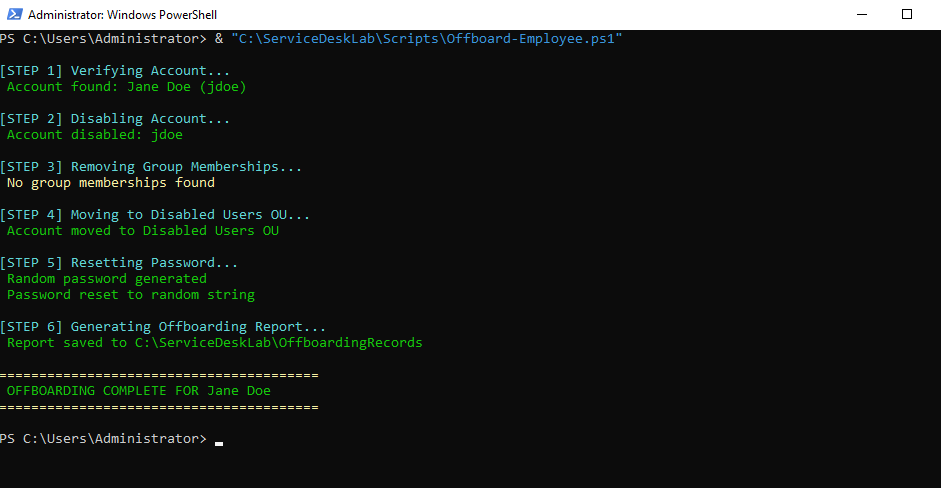
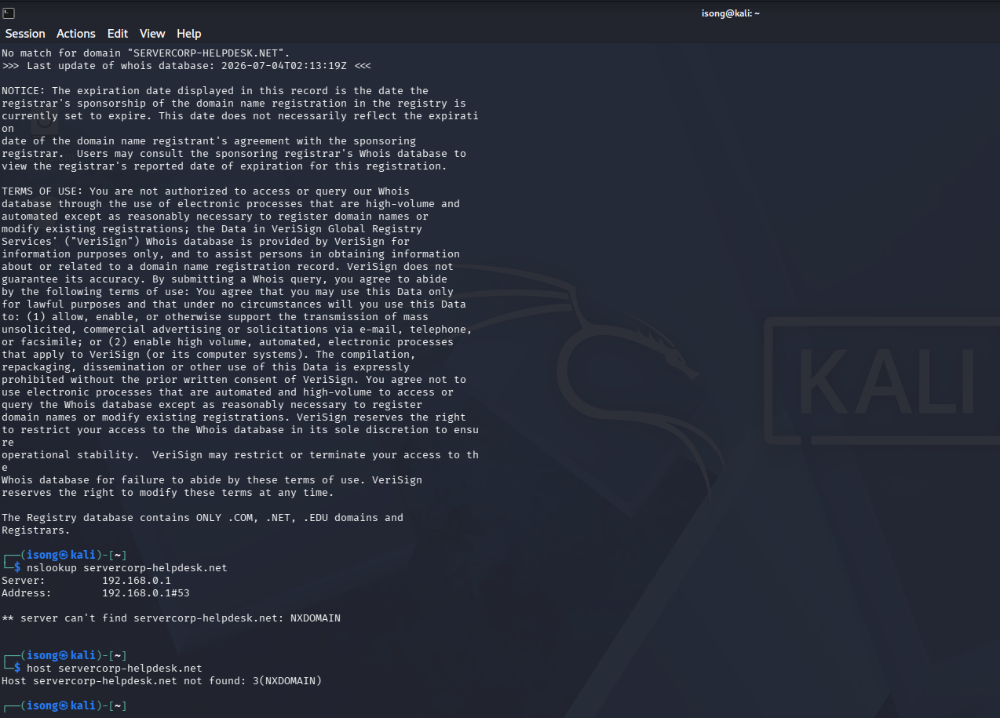

# 🖥️ Service Desk Home Lab

A fully functional enterprise Service Desk home lab built 
to simulate real-world IT support operations including 
Active Directory management, helpdesk ticketing, PowerShell 
automation and security incident investigation.

---

## 🎯 Project Overview

This lab was built to develop and demonstrate practical 
Service Desk Analyst skills across infrastructure setup, 
user lifecycle management, ticket resolution and 
cybersecurity awareness.

**Duration:** 1 Week  
**Environment:** VirtualBox (3 VMs)  
**Domain:** servercorp.local  

---

## 🏗️ Lab Architecture
CyberLab Network (192.168.100.0/24)
├── Windows Server 2022  → 192.168.100.10 (Domain Controller)
├── Windows 11 Pro       → 192.168.100.6  (Client Machine)
└── Kali Linux           → 192.168.100.5  (Security Analysis)

---

## ✅ What Was Built

### 🔧 Infrastructure
- Deployed **Windows Server 2022** in VirtualBox
- Promoted server to **Active Directory Domain Controller**
- Configured **DNS, DHCP** and domain services
- Joined **Windows 11 Pro** client to domain (servercorp.local)
- Built isolated **CyberLab NAT network** across 3 VMs

### 👥 Active Directory
- Created enterprise **Organizational Unit structure:**
  - IT Department
  - HR Department
  - Finance Department
  - Social Media Department
  - Disabled Users (offboarding)
- Provisioned multiple domain user accounts via PowerShell
- Configured folder permissions and shared drives

### 🎫 Helpdesk Operations (osTicket v1.18.4)
- Installed and configured **osTicket** on Windows Server
- Configured **SLA Plans:** SEV-A (1hr), SEV-B (4hr), SEV-C (8hr)
- Created **departments:** IT Support, Network Operations, Security
- Simulated and resolved **5 realistic Service Desk tickets:**

| Ticket | Issue | Priority | SLA | Resolution |
|--------|-------|----------|-----|------------|
| #152593 | Password Reset / Account Locked | High | SEV-B | AD account unlocked via PowerShell |
| #409131 | Suspicious Email / Phishing | Emergency | SEV-A | Kali investigation — confirmed phishing |
| #721277 | New Employee Onboarding | Normal | SEV-B | AD user created, folder access granted |
| #270288 | Hardware Issue / Slow Computer | High | SEV-B | Remote diagnostics, temp files cleared |
| #459244 | Network Connectivity Issue | High | SEV-B | DNS flushed, network stack reset |

### 💻 PowerShell Automation Scripts
| Script | Purpose |
|--------|---------|
| Onboard-Employee.ps1 | Creates AD user, assigns OU, grants folder access, generates report |
| Offboard-Employee.ps1 | Disables account, removes groups, moves to Disabled OU, resets password |
| Bulk-UserCreation.ps1 | Creates multiple users from CSV with email and department assignment |
| Hardware-Diagnostic.ps1 | Analyzes CPU, RAM, disk and clears temp files remotely |
| Network-Diagnostic.ps1 | Tests connectivity, flushes DNS and resets network stack |

### 🔐 Security Investigation
- Investigated phishing attempt using **Kali Linux**
- Performed **WHOIS, NSLOOKUP and HOST** analysis
- Confirmed phishing via **NXDOMAIN** — domain non-existent
- Filed formal **Security Incident Report** with IOCs documented
- Escalated ticket to **SEV-A Emergency** priority

---

## 🛠️ Tools & Technologies

| Category | Tools Used |
|----------|-----------|
| Virtualization | VirtualBox |
| Server OS | Windows Server 2022 |
| Client OS | Windows 11 Pro |
| Security OS | Kali Linux |
| Directory Services | Active Directory, DNS |
| Helpdesk | osTicket v1.18.4 |
| Web Stack | WAMP (Apache, MySQL, PHP) |
| Scripting | PowerShell 5.1 |
| Security Tools | WHOIS, NSLOOKUP, HOST |

---

## 📁 Repository Structure
service-desk-home-lab/
├── scripts/                    ← PowerShell automation scripts
├── screenshots/
│   ├── infrastructure/         ← Server setup and configuration
│   ├── active-directory/       ← AD structure and users
│   ├── osticket/               ← Helpdesk tickets and configuration
│   ├── powershell-scripts/     ← Script execution outputs
│   └── security/               ← Kali investigation results
└── documentation/              ← Reports and checklists
---

## 📸 Screenshots

### Infrastructure

### Active Directory Structure

### osTicket Dashboard

### PowerShell Automation

### Security Investigation (Kali Linux)

---

## 🎓 Skills Demonstrated

- ✅ Active Directory administration and user lifecycle management
- ✅ Helpdesk ticket triage, prioritization and resolution
- ✅ SLA management and escalation procedures
- ✅ PowerShell scripting and automation
- ✅ Network diagnostics and troubleshooting
- ✅ Security incident identification and documentation
- ✅ Phishing investigation using open source tools
- ✅ Professional IT documentation and reporting

---

## 👤 Author

Eti-ima Essien  
Service Desk Analyst | ISC2 Certified | TryHackMe SOC Level 1  
www.linkedin.com/in/eti-ima-essien | https://github.com/etimaessien007
